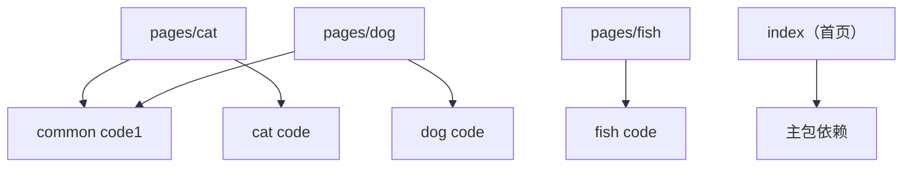
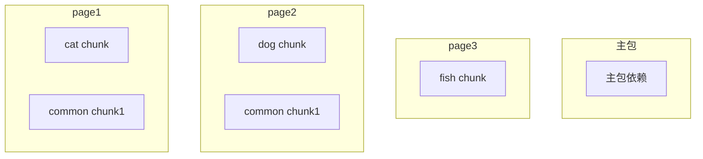

## 实现原理

### 核心思路

为了避免将所有页面的依赖都打入主包，需要分析依赖关系，对依赖代码进行拆分和打包，最终满足以下需求：

- **仅被子包依赖**而**不被主包依赖**的代码可以被打包为 chunks，放置到对应子包的根目录下
- 仅被一个页面依赖的 chunk，只应该出现在该页面的子包中
- 多个页面共同依赖的 chunk，才会存在多份，分别出现在每个引用了该 chunk 的页面的子包中

### 具体示例

假设项目有三个子包，每个子包中都有一个页面：

```javascript
subPackages: [
  {
    root: 'pages/cat',
    pages: ['cat'],
  },
  {
    root: 'pages/fish',
    pages: ['index'],
  },
  {
    root: 'pages/dog',
    pages: ['index'],
  },
]
```

每个页面均依赖了一些公共模块，假设依赖关系如下：


那么我们期望最后分包的结果如下：



可以通过遍历每个 module，计算出直接或间接依赖了它们的页面，即可知道它应该被打包到哪里。
对于一个 module：
- 如果它被主包依赖了，那么它应该被打包到主包中
- 如果它仅被一个页面依赖，那么它应该被打包到该页面的子包中
- 如果它被多个页面依赖，那么它应该被打包到每个依赖了它的页面的子包中

### 实现

本插件基于 Vite/Rollup 的插件机制，通过多个生命周期钩子实现分包：

1. **依赖收集阶段**：在 `moduleParsed` 钩子中收集所有模块的依赖关系
2. **依赖分析阶段**：在 `buildEnd` 钩子中分析依赖图，确定分包策略
3. **代码分割阶段**：在 `outputOptions` 钩子中重写 `manualChunks` 方法，完成将模块分配到对应 chunk 的逻辑
4. **引用更新阶段**：在 `renderChunk` 钩子中，根据分包结果，修改代码文件，更新各个模块的引用路径（js）
5. **文件输出阶段**：在 `generateBundle` 中修改 chunk 的输出位置，将 chunk 分配到对应的子包目录下；在 `writeBundle` 钩子中，根据分包结果，修改代码文件，更新各个模块的引用路径（wxss）
